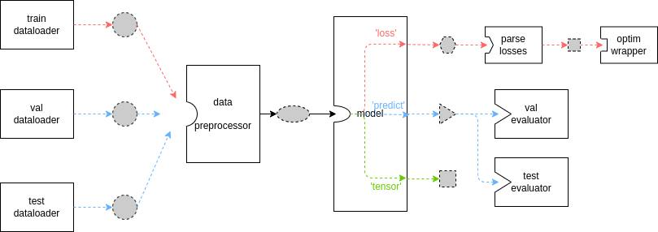

<div align="center">
    <h1>Any CV</h1>
    <h4>Openmim based repo to train any mmlab project linked as submodule</h4>
</div>

---

## Install:

```bash
make install
```

## Train:
```bash
CONFIG=configs/mnist.py \
WORKDIR=test_exp \
PROJECT=mmpretrain \
GPUS=0 \
make train
```

## Test:
```bash
CONFIG=configs/mnist.py \
WORKDIR=test_exp \
PROJECT=mmpretrain \
GPUS=0 \
CHECKPOINT=test_exp/epoch_2.pth \
make test
```

## Convert (Docker Required):

```bash
DEPLOY_CFG_PATH=mmdeploy/configs/mmpretrain/classification_onnxruntime_dynamic.py \
MODEL_CFG_PATH=mount/test_exp/mnist.py \
MODEL_CHECKPOINT_PATH=mount/test_exp/epoch_2.pth \
INPUT_IMG=mount/data/train/class_0/1.png \
TEST_IMG=mount/data/train/class_1/3.png \
WORK_DIR=mount/test_exp \
DEVICE=cpu \
PROJECT=mmpretrain \
make convert
```

## Inference:

To run example inference using the ONNX model, use the following command:

```bash
PROJECT=mmpretrain \
CONFIG_PATH=test_exp/mnist.py \
MODEL_PATH=test_exp/end2end.onnx \
IMAGE_PATH=data/train/class_0/1.png \
make infer
```

### FYI:
Mmlab work diagram:
<div align="center">
    
</div>

Data is preprocessed using `mmengine.Compose` inside datasets and optionally at data preprocessor inside the model.

So, we reuse this logic in the infernce script for further use with Triton.


## MNIST Example:

```bash
# download mnist data
python anycv/load_mnist.py

# train model
CONFIG=configs/mnist.py \
WORKDIR=test_exp \
PROJECT=mmpretrain \
GPUS=0 \
make train

# convert model
DEPLOY_CFG_PATH=mmdeploy/configs/mmpretrain/classification_onnxruntime_dynamic.py \
MODEL_CFG_PATH=mount/test_exp/mnist.py \
MODEL_CHECKPOINT_PATH=mount/test_exp/epoch_2.pth \
INPUT_IMG=mount/data/train/class_0/1.png \
WORK_DIR=mount/test_exp \
DEVICE=cpu \
PROJECT=mmpretrain \
make convert
```